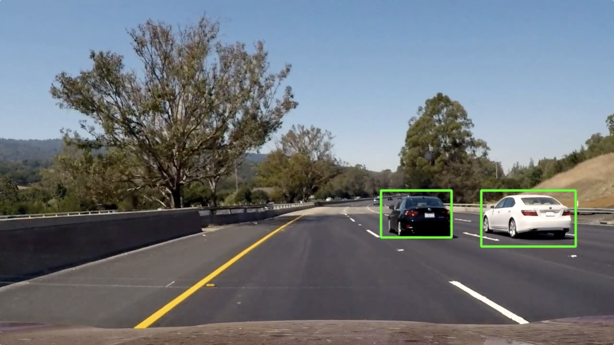

# **Vehicle Detection**

[//]: # (Image References)

[image0]: ./examples/cover.png
[image1]: ./output_images/training_data_samples.png
[image2]: ./output_images/HOG_features.png
[image3]: ./output_images/spatial_samples.png
[image4]: ./output_images/slide_window.png
[image5]: ./output_images/heatmap1.png
[image6]: ./output_images/heatmap2.png
[image7]: ./output_images/heatmap3.png
[image8]: ./output_images/heatmap4.png
[image9]: ./output_images/heatmap5.png
[image10]: ./output_images/heatmap6.png

This is a brief writeup report of Self-Driving Car Engineer P5.

---

**Vehicle Detection Project**

* Perform a Histogram of Oriented Gradients (HOG) feature extraction on a labeled training set of images.

* Apply a color transform and append binned color features, as well as histograms of color, to the HOG feature vector.

* Normalize the features and randomize a selection for training and testing.

* Train a Linear SVM classifier.

* Implement a sliding-window technique and use the trained classifier to search for vehicles in images.

* Run the pipeline on a video stream and create a heat map of recurring detections frame by frame to reject outliers and follow detected vehicles.

* Estimate a bounding box for vehicles detected.

 

## Feature Extractionon

The code for this step is contained in the 2nd to 10th code cells of the IPython notebook located in `P5.ipynb`

#### 1. Labeled training Data

The traing data includes two parts of labeled [vehicle](https://s3.amazonaws.com/udacity-sdc/Vehicle_Tracking/vehicles.zip) and [non-vehicle](https://s3.amazonaws.com/udacity-sdc/Vehicle_Tracking/non-vehicles.zip) examples. It has 8792 vehicle images and 8968 non-vehicle images, which are from a combination of the [GTI vehicle image database](http://www.gti.ssr.upm.es/data/Vehicle_database.html), the [KITTI vision benchmark suite](http://www.cvlibs.net/datasets/kitti/), and examples extracted from the project video itself.

Here are sample images:

![alt text][image1]

#### 2. Histogram of Oriented Gradients (HOG)

The parameters of HOG are set as follow:

* HOG color channel `color_space = 'YCrCb'`

* HOG orientations `orient = 9` 

* HOG pixels per cell `pix_per_cell = 8` 

* HOG cells per block `cell_per_block = 2` 

* HOG channels to extract `hog_channel = 'ALL'`

Here are extracted HOG features in gray from sample images of training data set:

![alt text][image2]

#### 3. Append binned color features, histograms of color, to the HOG feature vector

The parameters of color related features extractionon are set as follow:

* Spatial binning dimensions `spatial_size = (32, 32)` 

* Number of histogram bins `hist_bins = 32`

The spatial size of 32x32 can still have the vehicle shape:

32x32 pixels is the final spatial size because of its
vehicle shape obvious yet:

![alt text][image3]

 

## Train a Linear SVM classifier

The code for this step is contained in the 11th and 12th code cells of the IPython notebook located in `P5.ipynb`

By concatenating 9 orientations 8 pixels per cell and 2 cells per block HOG, as well as binned color features and histograms of color, the feature vector has 8460 length.

First, use `sklearn.model_selection.train_test_split()` function to split full data set into training and testing set, and random their orders to avoid overfitting.

After that, use `sklearn.preprocessing.StandardScaler()` to normalize `X_train`, then transform both `X_train` and `X_test`.

Finally, the linear SVM classifier cost **23.79** seconds to train, and test accuracy is **98.73%**.

 

## Sliding Window Search and Heat Map

The code for this step is contained in the 13th to 22th code cells of the IPython notebook located in `P5.ipynb`

#### 1. Implement sliding-window technique

Three sizes of sliding-windows are choosen in the project.

| xy_window        | xy_overlap   | y_start_stop |
|:-------------:|:-------------:| :---:|
| (64, 64)      | (0.8, 0.8)        | [400, 496]
| (96, 96)      | (0.7, 0.7)      |[400,544]
| (128, 128)     | (0.5, 0.5)      |[500,692]

The layout of sliding-windows is like this:

![alt text][image4]

#### 2. Implement heatmap technique

Use `scipy.ndimage.measurements.label()` to find the heat map of each vehicle detected hot windows, and the threshold of heat point is `2`, which can reject outliers.

Here are the results of combining the search windows and heatmaps techniques on test images:

![alt text][image5]
![alt text][image6]
![alt text][image7]
![alt text][image8]
![alt text][image9]
![alt text][image10]

 

## Video Implementation

The code for this step is contained in the 23th to 27th code cells of the IPython notebook located in `P5.ipynb`

A function named `box_process()` is created for integrating box information among the continuously frames.
The current bounding boxes to draw are calculated by the box-edge pixels in the past 10 frames.

In addition, the pipeline includes these functions defined in the project:

* `search_windows()`
* `add_heat()`
* `apply_threshold()`

Same as before, `moviepy.editor.VideoFileClip()` was used for video processing. 

Here's a [link to my video result](./project_output.mp4)

 

## Discussion

#### 1. Color space selection is an important key to the classifier

Although the SVM is so powerful and a Linear SVM classifier is very fast and accurate, different color spaces can result in different test accuracy, which might be a difference above 10%.

So, the `'YCrCb'` color space was choosen for this project because of its enough good training speed and test accuracy.

#### 2. Counter false positives 

Computer vision might not be a perfect solution on countering false positives. There are some miss accuracy of classifiers, some confuse shapes or shadows, some mixed colors, and so on, to make false positive. 

Those problems can be fixed in one project, but it would be hard to solve in a real time self driving scene.

#### 3. Traditional Computer Vision or Deep Neural Network

Both approaches have their strengths and weaknesses, in terms of performance, development effort, interpretability, etc.

There are some good Deep Neural Network algorithm for target detection, such as Faster-RCNN, which is published in recent year. It should be exciting to practise this project again on Deep Neural Network later.